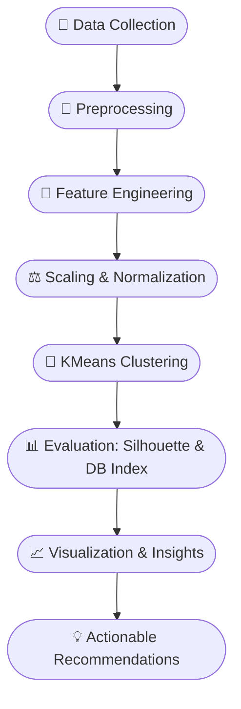

# 🌿 Wellness Personas of SNU  
> **Uncovering lifestyle clusters among students at Sister Nivedita University**
> *A Machine Learning Project on Student Lifestyle Clustering* 


---

## 📘 Overview

This project — **Wellness Personas of SNU** — uses **Machine Learning (KMeans Clustering)** to understand and group students based on their daily habits.  
By analyzing **eating frequency, eating habits, food budget, sweet preferences, hobby hours, and spending behavior** we discover **distinct wellness personas** that reflect how students balance health and lifestyle.

> 🎯 **Objective:**  
> To cluster students based on lifestyle patterns and recommend healthier, more balanced living strategies.


**Developed by:** [Priyanka Banerjee](#)  
**University:** Sister Nivedita University  
**Date:** November 2025  
**Language:** Python 🐍  
**Frameworks:** scikit-learn, pandas, seaborn, matplotlib  
**Goal:** Identify clusters of student behavior for wellness improvement programs.

---

## 🎯 Problem Understanding

Many students struggle to maintain a balanced lifestyle on campus — irregular eating, junk food, or lack of hobbies.  
This project helps the **University Wellness Team** to:
- Identify lifestyle trends
- Promote healthier habits
- Personalize recommendations for canteen, wellness clubs, and recreational programs.

---

## 💡 Assumptions

- All form responses are **truthful** and **self-reported**.  
- Missing values are handled using **median imputation**.  
- Higher hobby hours = healthier lifestyle  
- Frequent eating out = less healthy habits  

---

## 📊 Features Used

| Feature | Description |
|----------|-------------|
| 🍔 `eating_out_per_week` | Number of times a student eats outside weekly |
| 💰 `food_budget_per_meal_inr` | Average money spent per meal |
| 🍫 `sweet_tooth_level` | Sweetness preference on scale 1–5 |
| 🎨 `weekly_hobby_hours` | Average hours spent on hobbies per week |

---

## 🧠 Model Selection

### Why **Clustering**?
We don’t have predefined “labels” like *healthy* or *unhealthy*.  
Instead, we **discover patterns** from the data using **unsupervised learning**.

### Why **KMeans**?
- Simple yet powerful for numeric data  
- Easy to visualize in 2D using PCA  
- Validated using **Silhouette Score** & **Davies–Bouldin Index**

---

## ⚙️ Workflow




## 🧮 Evaluation Metrics

| Metric | Description | Higher = Better |
|:-------|:-------------|:----------------|
| 🧩 **Silhouette Score** | Measures how well each sample fits within its cluster | ✅ |
| 📉 **Davies–Bouldin Index** | Measures separation between clusters | ❌ |

---

## 📈 Visualizations

### 1️⃣ PCA Cluster Plot
Displays clusters in a 2D reduced space.

### 2️⃣ Boxplots by Cluster
Compare how each group differs for eating, spending, and hobbies.

### 3️⃣ Correlation Heatmap
Shows the relationships between all numerical features.

---

## 🧩 Cluster Personas (Sample)

| Cluster | Description | Persona Name |
|:--------|:-------------|:--------------|
| 0 | Low eating out, high hobby hours | 🥗 **Health-Conscious** |
| 1 | Moderate eating & hobby balance | ⚖️ **Balanced Lifestyler** |
| 2 | High eating out, low hobbies | 🍕 **Fast-Food Enthusiast** |

---

## 💬 Insights & Recommendations

- Students who spend less and engage more in hobbies are generally the **healthiest group**.  
- University can organize **“Healthy Meal Days”** and **“Weekend Hobby Clubs”**.  
- Fast-food lovers can be encouraged to join **fitness or creative clubs** to balance their lifestyle.

---

## 🧰 Tech Stack

| Component | Tool |
|:----------|:------|
| **Language** | Python 3.10 |
| **Libraries** | pandas, scikit-learn, seaborn, matplotlib |
| **ML Model** | KMeans Clustering |
| **Visualization** | PCA, Boxplots, Heatmaps |
| **Deployment** | GitHub Pages / Streamlit |
| **Dataset** | Google Form responses (or synthetic test data) |

---


## 💾 Files & Directory Structure


```bash
Wellness_Personas_SNU/
├── data/
│   ├── clustered_results.csv              # Final processed data with clusters
│   └── raw_google_form_responses.csv      # Original survey responses
├── notebook/
│   └── Wellness_Personas_SNU.ipynb        # Jupyter notebook for analysis
├── website/
│   └── index.html                         # Interactive website (Tailwind + Plotly.js)
├── report/
│   └── Wellness_Personas_Report.pdf       # Final project report
└── README.md                              # Project documentation
```

---

## 🌐 Live Website

🔗 **[View Project Website](https://your-username.github.io/Wellness-Personas-SNU/)**  
> Includes interactive visualizations (PCA, boxplots, insights) built with **Tailwind CSS + Plotly.js**.

---

## 🧠 Project Overview

| **Feature** | **Description** |
|--------------|----------------|
| **Objective** | To cluster students into wellness personas based on lifestyle data (sleep, study habits, eating out, hobbies, etc.). |
| **Algorithm** | K-Means Clustering |
| **Language** | Python |
| **Libraries** | Pandas, NumPy, Scikit-learn, Matplotlib, Seaborn, Plotly |
| **Visualization Tools** | Tailwind CSS + Plotly.js (Web Dashboard) |
| **Dataset Output** | [`clustered_results.csv`](data/clustered_results.csv) |

---

## 📊 Key Visualizations

- PCA Scatter Plot (Cluster Distribution)  
- Boxplots (Lifestyle features per cluster)  
- Cluster Size Bar Chart  
- Correlation Heatmap  
- Cluster Insights & Recommendations

---

## 🧑‍💻 How to Run Locally

```bash
# 1. Clone this repository
git clone https://github.com/your-username/Wellness-Personas-SNU.git

# 2. Navigate to the project folder
cd Wellness-Personas-SNU

# 3. Install dependencies
pip install -r requirements.txt

# 4. Run the notebook
jupyter notebook Wellness_Personas_SNU.ipynb

# 5. (Optional) Run the website locally
open website/index.html


## 🏅 Evaluation Criteria (As per SNU Guidelines)

| Category | Marks |
|-----------|-------:|
| Problem Understanding | 10 |
| Data Preprocessing | 20 |
| Model Selection | 15 |
| Code Quality | 15 |
| Evaluation & Metrics | 15 |
| Visualization | 10 |
| Insights & Recommendations | 10 |
| Originality | 5 |
| **Total** | **100** |

---

## 💾 Outputs
| File | Description |
|------|--------------|
| `clustered_results.csv` | Final dataset with assigned cluster labels |
| `Wellness_Personas_SNU_Report.pdf` | Summary report |
| `index.html` | Interactive project website |

---

## 🧑‍🏫 Acknowledgment
Special thanks to:

- **Sister Nivedita University (SNU)** for promoting innovation  

---

## 📜 License
This project is released under the **MIT License**.  
Feel free to use and modify for educational purposes.

---


<details>
  <summary>📊 Expand to view Evaluation Summary</summary>

| Step | Description | Weight |
|------|--------------|--------:|
| Data Cleaning | Outlier removal, scaling, normalization | 20% |
| Clustering | K-Means, Silhouette optimization | 25% |
| Visualization | PCA plots, heatmaps, distributions | 15% |
| Insight Generation | Personas + Recommendations | 25% |
| Website & Presentation | Dashboard and documentation | 15% |

</details>

---


👨‍💻 *Developed with ❤️ by [Priyanka Banerjee](https://github.com/PriyankaBanerjee2004)*

